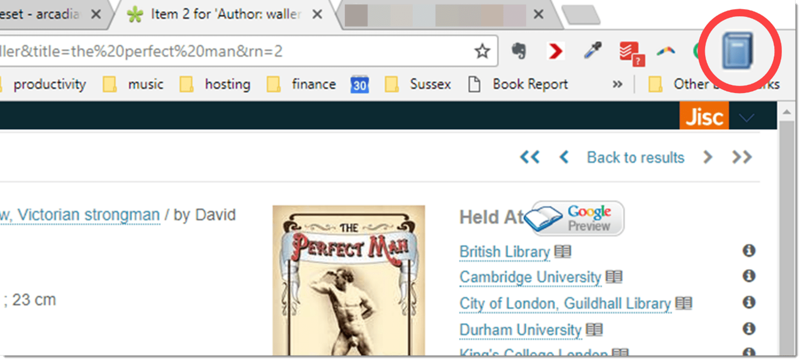

There are many ways to add items to Zotero and this flexibility is one of its strengths. Here are some of the main options: 

### Automatic capture

The easiest way to add items to Zotero is through bibliographic websites or databases. Zotero automatically senses when you are viewing a webpage containing bibliographic data and allows you to download it with one click. This functionality works on most library catalogues, journal databases, and major websites such as Amazon. Support for other sites is added all the time and a full list is available on the [Zotero website](http://www.zotero.org/support/translators).

If a website is compatible with Zotero, you will see a small icon next to the address bar of your browser. 

{}
Zotero must be running for this to work properly and you need to have the appropriate Connector installed.
{}

Here I’ve found a book on Library Hub Discover – a very useful website that aggregates many library catalogues – and you can see that Zotero is displaying a book icon (I’ve magnified it here for ease of recognition).

It should appear in the same place if you’re using Chrome, Firefox, or Edge. Safari users will need to look for a similar icon to the left of the address bar.

Simply click on the icon, and a small dialogue box appears in the top right-hand corner of your browser window that says, “Saving to My Library …”. 

The icon displayed depends on the type of reference. You’ll see some other examples later in the chapter.

In Zotero, I can now see that my book details have been added:

If you have a **Collection** selected, that’s where your item will land; otherwise, it’s just added to My Library.

Now, sometimes the data you import from websites can be a bit untidy. You can see in the example above that the book title is all in lowercase, which, for pedants like me, is unacceptable. Fortunately, it’s very easy to convert it with a couple of clicks. Right-click on the title field, then choose **Title Case**.

If you wanted just the first word capitalised, choose **Sentence Case**.

Much better!

This also works on the Short Title field. This field is used for an abbreviated version of your book title that’s displayed in subsequent references. The full version appears only once. If you have a really long title, you don’t want to have to include the whole thing every time (especially if you’re working against a word limit). 

In this example, I've saved 10 words by including a short title.

Sometimes if a database isn’t compatible with Zotero, there will be an option to download a citation – it might say Export to EndNote or Reference Manager or Export to RIS. Choosing this option downloads a RIS file which, when double-clicked, will add the citation to your Zotero library.

### Adding by Identifier

If you have a publication with an identifier, you can simply type it in and Zotero will retrieve the details. Compatible identifiers include ISBNs on books, DOIs (Digital Object Identifiers) for online journal articles, PMIDs for the PubMed database, and IDs for the arXiv.org repository. Click the magic wand icon and add your number.

