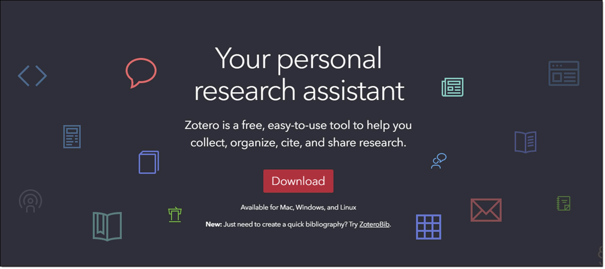
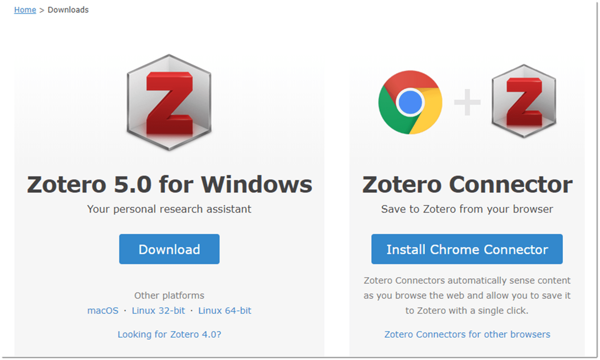
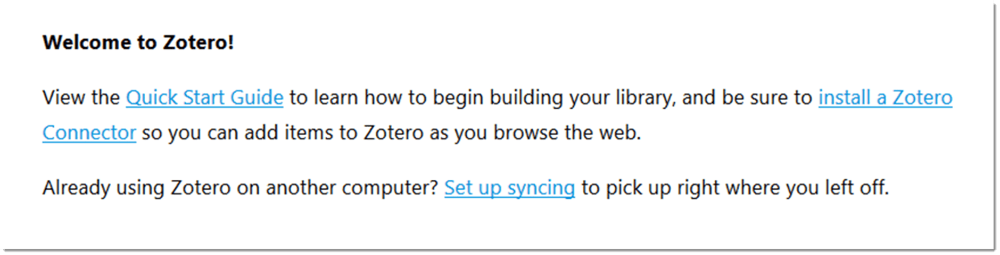
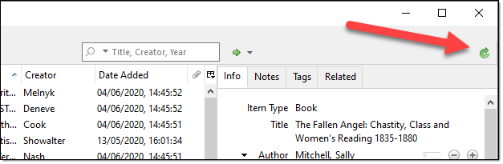
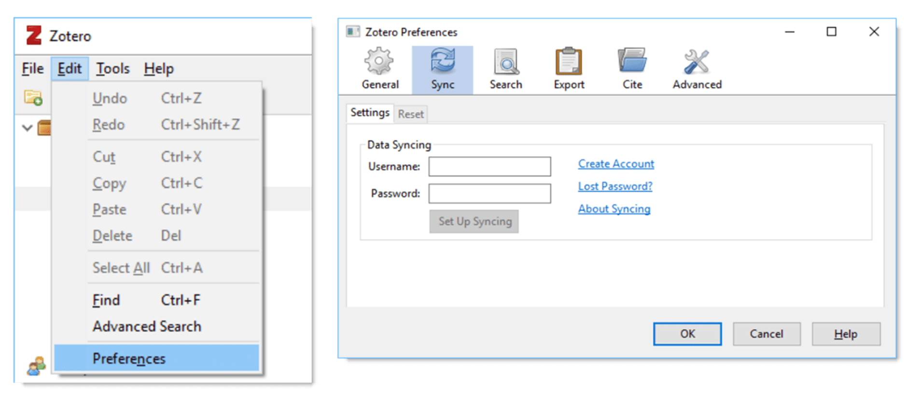

If you already have Zotero installed, you can skip to the next chapter. 

Otherwise, head over to www.zotero.org and click the big red Download button.

The webpage should automatically detect what platform and web browser you’re using – in this case, it’s Windows and Chrome.

You’ll also need Zotero Connector. This connects your web browser and Zotero, and is available for Chrome, Safari, Firefox, and Microsoft Edge. Don’t worry about the Connector for now – you’ll be prompted again once you’ve installed Zotero.

So, go ahead with the download and then install Zotero. 

Once launched, you’ll see a welcome message. Now’s the time to click the link and install the Zotero Connector for your browser.

## Creating a Zotero login

If you already have a Zotero login, click the **Set up syncing** link to enter your details. Then click the green sync icon in the top right-hand corner of Zotero to import your existing Library.

Otherwise, you should be directed back to the Zotero website and asked to create a username and password. If this doesn’t happen, then please visit the registration page.

Creating a Zotero login is very important, as it’ll allow you to access your Library across multiple devices and join Groups (shared Libraries). Furthermore, your valuable data will be backed up automatically.

To change your login details at any time, click **Edit > Preferences in Zotero** (Zotero > Preferences on a Mac), then click on the **Sync** tab:

I’m going to run through what all of this means later, but for now you just need to enter your Zotero login details and click **OK**.

Right, you’re all set. Let’s start exploring Zotero.
